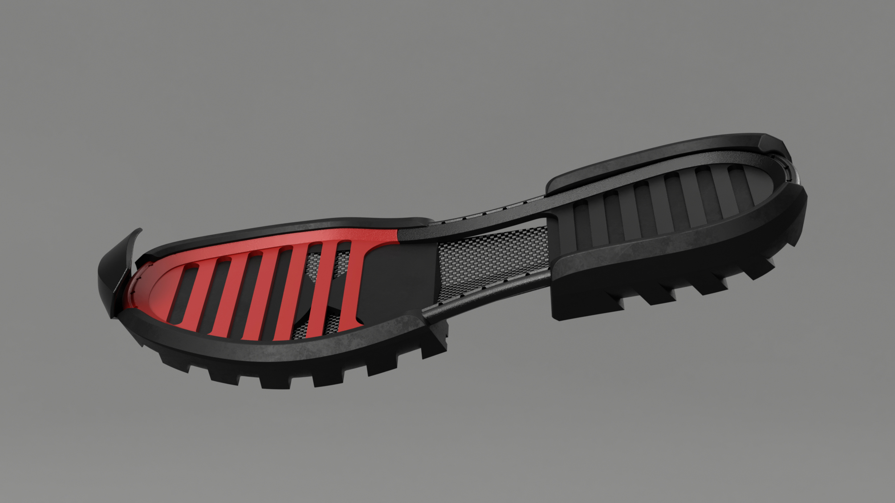

# Last bike shoe

## Challenges

1. Build adaptable bikepacking footwear with variable stiffness outsoles for riding and hiking
2. Most adventure cyclists ride through variety of climate and terrain, and buying purpose specific shoes adds up
3. With composite shanks, hardware and foams, cycling shoes are a multi-material disposal disaster

## Outcomes

1. A pleated rigid core that stops just shy of the metatarsal. Testing showed walkability close to a trail runner, while maintaining pedal stiffness comparable to a mountain bike shoe.
2. The N+ Platform - a quiver-killer of a shoe design that adapts to different types of riding, weather and adventures.
3. World's first additive-enabled, open source cycling shoe. Modular, serviceable, repairable with an open source design riders can adapt to their own needs. Semi-circular 3D printed TPU soles can be recycled into feedstock for new soles.

---

N+ is a bicycle shoe designed to provide a stiff pedaling platform while maintaining walkability off the bike. It's also an open-source design that's modular, serviceable and can be produced with readily available tools and techniques. It's a project exploring new consumer models of ownership and challenging expectations around the product life cycle.

N+ Platform was the final project of my Bachelor of Design - Product Design program in 2016 - read the  [Thesis Report](https://www.notion.so/Thesis-Report-795fb820494c4eefa807762894f369b8)

## Research

For this research project I was focused (okay not strictly focused as you will see...) on variable stiffness outsoles. The paradox I set out to solve — a walking/hiking shoe isn't ideal for biking, and a bike shoe is notoriously clumsy to walk in.

Early research posters identifying challenge & opportunities

A mix of sketches at various fidelity

Assorted artefacts arranged on a wall

Exploded view of a concept (illustrator)

Rendered concept (photoshop)

## Design

Render in Fusion360 - one assembly surrounded by disassembled counterpart

### Modular Design

The shoe is designed as a modular system that allows riders to tweak and tune the shoe in the same way they would get a bike 'dialed' for a particular adventure.

- Easy to repair and disassemble
- replaceable outsole made without glue
- repairable and interchangeable textile
- tunable for different conditions, seasons, rides

As a bonus, non-traditional construction makes for a more sustainable extended product lifecycle. High-wear pieces like the outsole can be replaced when they're worn, and at different rates too — pedal wear happening faster than walking/heel wear. Textiles that tear or stink can be washed, repaired or replaced. The composite core, which will last centuries, fits a range of sizes and can be reused forever - leave it in your will!

### Additive-Enabled

Exploring the potential of digital manufacturing, I've used the term 'additive-enabled' because the composite core us made using a 3D printed mold and 3D printed threaded inserts to give shape to the core. The textile uppers are produced with good old fashioned textile technologies.

The frame (heel & toe), outsole (heel & toe), pedal inserts (platform & SPD) and toe-guard were all 3D printed.

Render shown without textile uppers

Close-up of 3D printed TPU outsole

### Open-source Platform

So why a platform? What does that even mean? This project wouldn't have happened if it weren't for the RepRap project and proliferation of affordable 3D printing. I released the designs and project with an open source license because it would allow for a few interesting possibilities;

- People creating and sharing patterns and designs and components for free or profit
    - It would allow space for cottage makers to produce textile uppers, an interesting challenge and SKU
- Collaboration & competition
    - Imagine tire manufacturers adapt their existing tire tread catalog to fit the shoes
    - Imagine composite companies producing and selling cores
    - Imagine clothing and accessory brands can step into the shoe market with textile uppers and other parts
- Make nice bike shoes more accessible
    - People can make do with what they have available to hack together a decent shoe for themselves, that idea is pretty unthinkable for performance cycling shoes.
    - Eventually a market of used components (carbon cores) could exist to be combined with new replacement parts (fresh treads, textile uppers)

---

[les-original/last-shoe](https://github.com/les-original/last-shoe)

Assembled shoe, shoe components, DIY kit option

Top 20 finalist for **Hackaday**Prize2017 'Anything Goes' category

Assembled shoe

### Construction

3D printed core inserts with heat-set threads

3D printed heel frame

Composite lay-up of the core

Textile uppers, frame, core, outsole

Printed mold, inserts, and CF/Flax matrix in a FoodSaver vacuum bag

Assembled after testing - with platform pedal insert

### Testing

Toe flexion - walking

Toe flexion - pedalling

Research Testing Poster

Testing Results show the prototype performed comparably to a cycling shoe and a trail runner

Three comparison shoes

# More Links

**I've shared some stuff on Instagram**

[#nplusplatform](https://www.instagram.com/explore/tags/nplusplatform/)

[@nplus.bike](https://www.instagram.com/nplus.bike/)

[Sign up](https://last.lesoriginal.com/n-plus-signup) to access more stuff related to this project

[GitHub repo](https://github.com/les-original/last-shoe)
